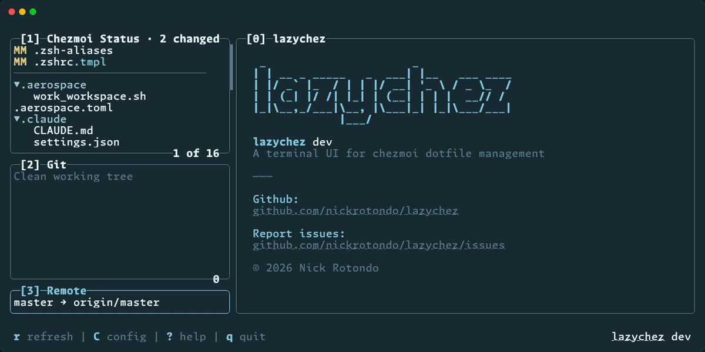

# lazychez

**[lazygit](https://github.com/jesseduffield/lazygit), but for your dotfiles.**

Your `.zshrc` is on three machines and none of them match. Sound familiar? [chezmoi](https://www.chezmoi.io/) solves this — it's a dotfile manager that tracks your config files in a git repo and applies them consistently across every machine you touch. It's powerful, well-designed, and entirely CLI-driven.

lazychez gives chezmoi a proper terminal UI. Browse your managed files, see what's changed, view diffs, add or apply changes, and push it all to git — without stringing together five commands from memory.

<p align="center">
  
</p>

## Why lazychez

- **See changes instantly** — chezmoi status codes show exactly what diverged, at a glance
- **Inline diffs** — syntax-highlighted, scrollable, right there in your terminal
- **Template preview** — press `t` on any `.tmpl` file to see its rendered output for this machine (`chezmoi cat`)
- **Full git workflow built in** — stage, commit, push, pull without switching tools
- **Fuzzy file picker** — add unmanaged files to chezmoi without typing paths
- **Fuzzy file filter** — type `/` to narrow the file list instantly, lock the filter with `Enter`, work on just the matches
- **Forget files** — remove files from chezmoi management when you're done with them
- **Responsive layout** — side-by-side on wide terminals, stacked on narrow ones
- **Vim-style navigation** — btw

## Install

### Homebrew

```bash
brew tap nickrotondo/tap
brew install lazychez
```

### Go

```bash
go install github.com/nickrotondo/lazychez@latest
```

### From source

```bash
git clone https://github.com/nickrotondo/lazychez.git
cd lazychez
go build
./lazychez
```

## Prerequisites

- [chezmoi](https://www.chezmoi.io/install/) installed and initialized (`chezmoi init`)
- Git
- A git remote configured in your chezmoi source directory (needed for push/pull — see [chezmoi quick start](https://www.chezmoi.io/quick-start/))

## Usage

Run `lazychez` from anywhere — it automatically finds your chezmoi source directory.

> [!TIP]
> Alias it to something short like `lc` or `chez`. Your future self will thank you.

### Layout

The UI has four panes:

| Pane                   | What it shows                                                       |
| ---------------------- | ------------------------------------------------------------------- |
| **[1] Chezmoi Status** | All chezmoi-managed files with status codes; `.tmpl` files labeled in teal |
| **[2] Git**            | Git status of your chezmoi source directory                         |
| **[3] Remote**         | Branch tracking info — ahead/behind commit counts                   |
| **[0] Detail**         | `chezmoi diff`, `chezmoi cat`, or `git diff` for the selected file  |

Wide terminals (≥85 columns) get a side-by-side layout — file list, git status, and remote info on the left, detail pane on the right. Narrow terminals stack everything vertically.

<!-- TODO: add layout GIF or screenshot here -->

### How it works

lazychez wraps the `chezmoi` and `git` CLIs under the hood. It calls `chezmoi managed`, `chezmoi status`, and `git status` to populate the panes, then delegates to `chezmoi add`, `chezmoi apply`, `git commit`, etc. for every operation.

**Status codes** are chezmoi's native two-character format (`XY`), shown inline next to each file:

- **Column 1** — what `chezmoi add` would change in source (`M`, `A`, `D`, or space)
- **Column 2** — what `chezmoi apply` would change in destination (`M`, `A`, `D`, or space)

### Keybindings

<details>
<summary><strong>Navigation</strong></summary>

| Key                 | Action                          |
| ------------------- | ------------------------------- |
| `j` / `k`           | Move down / up                  |
| `g` / `G`           | Jump to top / bottom            |
| `Ctrl+d` / `Ctrl+u` | Half-page down / up             |
| `H` / `L`           | Previous / next pane            |
| `Tab` / `Shift+Tab` | Next / previous pane            |
| `←` / `→`           | Cycle between file list and git |
| `0`–`3`             | Jump to pane                    |
| `Esc`               | Back from diff pane             |

</details>

<details>
<summary><strong>Chezmoi pane</strong></summary>

| Key     | Action                                               |
| ------- | ---------------------------------------------------- |
| `s`     | Re-add file (destination → source)                   |
| `a`     | Apply file (source → destination)                    |
| `A`     | Apply all files                                      |
| `t`     | Toggle template preview (`chezmoi cat`) — `.tmpl` files only |
| `e`     | Edit source (`chezmoi edit`)                         |
| `+`     | Add unmanaged file (fuzzy file picker)               |
| `x`     | Forget file (remove from chezmoi)                    |
| `/`     | Filter files (fuzzy search)                          |
| `Enter` | Lock filter (work on filtered matches)               |
| `Esc`   | Cancel / exit filter                                 |

> After re-add, the status bar shows an undo hint directing you to the Git pane.
>
> Press `t` on a template file to see its rendered output for the current machine. Navigate to a different file to return to diff view.

</details>

<details>
<summary><strong>Git pane</strong></summary>

| Key     | Action                              |
| ------- | ----------------------------------- |
| `Space` | Stage / unstage file                |
| `a`     | Stage all files                     |
| `c`     | Commit (opens message input)        |
| `p`     | Pull from remote                    |
| `P`     | Push to remote                      |
| `D`     | Discard changes (with confirmation) |

</details>

<details>
<summary><strong>General</strong></summary>

| Key | Action              |
| --- | ------------------- |
| `r` | Refresh all panes   |
| `C` | Edit chezmoi config |
| `?` | Toggle help overlay |
| `q` | Quit                |

</details>

## Built with

- [Go](https://go.dev/)
- [Bubbletea](https://github.com/charmbracelet/bubbletea) + [Lipgloss](https://github.com/charmbracelet/lipgloss) from the [Charm](https://charm.sh/) ecosystem

---
